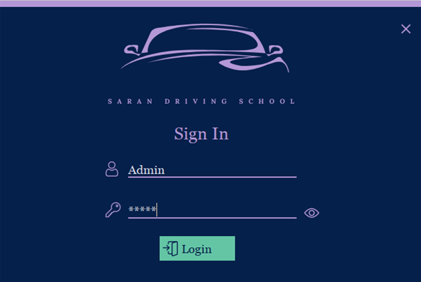
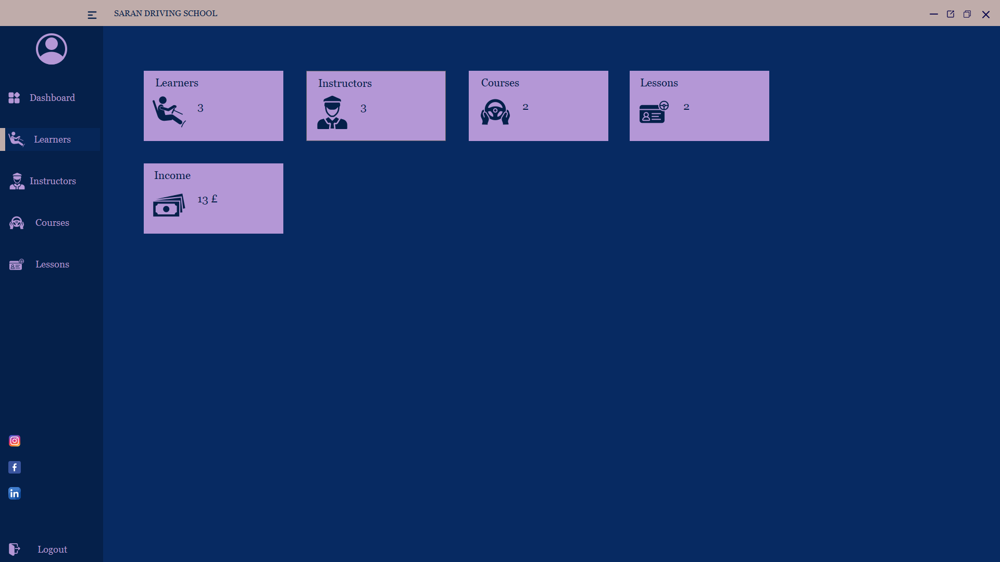
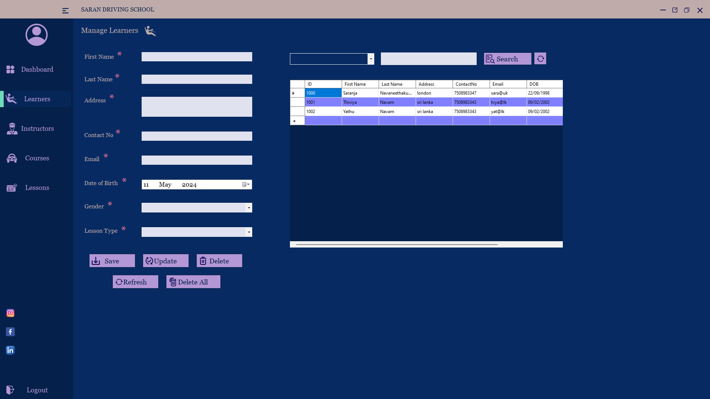
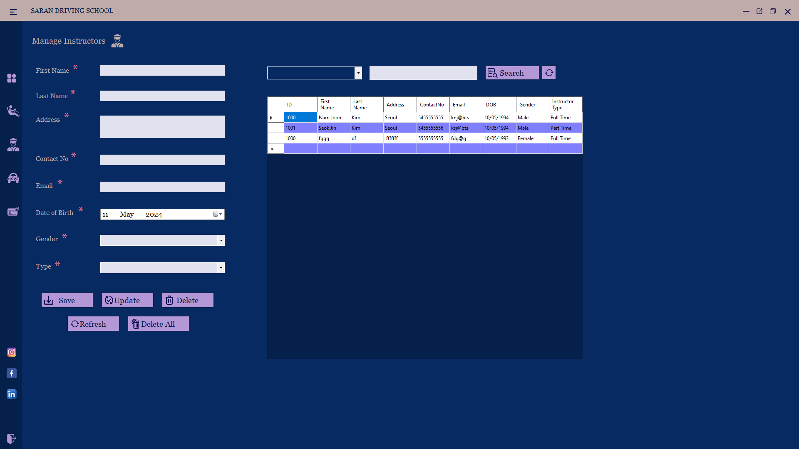
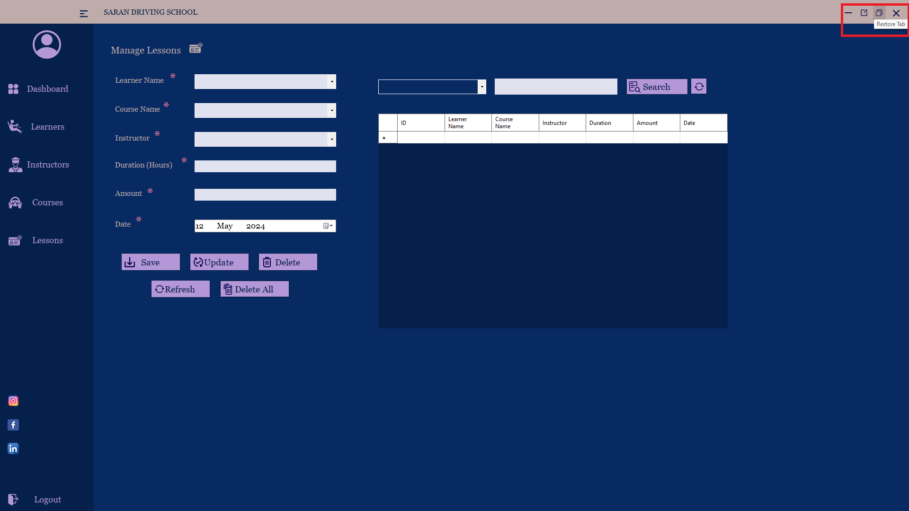
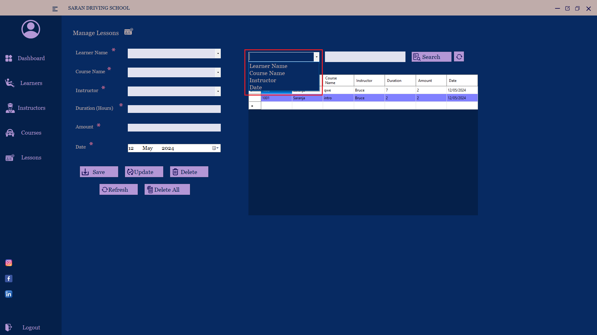

# HCI Driving School Management System (VB.NET)

## Overview
This project is a **Driving School Management System** developed using **VB.NET Windows Forms** as part of a **Human Computer Interaction (HCI)** assignment.

The system is designed to manage:
- Learners
- Instructors
- Courses
- Lessons

It focuses on **usability, accessibility, and user-friendly design** with features like validation, tooltips, voice feedback, and dynamic UI.

---

## Objectives
- Apply **HCI principles** in real application development
- Design a **user-friendly interface**
- Implement **input validation and feedback**
- Improve accessibility using **voice assistance**

---

## Features

### Learner Management
- Add new learners
- Search for the learners
- Update learner details
- Delete selected learner
- Delete all learners
- Display learners in a table

### Instructor Management
- Add, Update, Search and Delete the instructor details
- Display the instructor in a table
- Manage instructor information
- Assign lessons

### Course & Lesson Management
- Add, Search and manage courses
- Lesson types:
  - Introductory
  - Standard
  - Pass Plus
  - Driving Test

###  Search Functionality
- Search learners, instructors, courses, lessons easily

---

## UI / UX Features
- Sidebar navigation (expand & collapse)
- Button hover effects with color changes
- Panel highlighting for active menu
- Tooltips for guidance
- Clean and consistent layout

---

## Accessibility Features
- Voice feedback using **SpeechLib (Text-to-Speech)**
- Improves usability for users

---

## Key Concepts Used
- Event-driven programming
- Data handling using `DataTable`
- Input validation
- Error handling (`Try-Catch`)
- UI interaction (hover, click, focus)
- HCI design principles

---

## Technologies Used
- **Language:** VB.NET  
- **Framework:** Windows Forms (.NET)  
- **IDE:** Visual Studio  
- **Libraries:**
  - System.Data
  - System.Globalization
  - SpeechLib (Text-to-Speech)

---

## How to Run the Project
1. Open the project in **Visual Studio**
2. Build the solution  
3. Run the project
4. Press F5
5. Login Credentials
   * Username: Admin
   * Password: 12345

---
##  UI Preview

Simple and interactive interface:

- Sidebar navigation  
- Input forms  
- Buttons for actions  
- Real-time feedback  

---

## HCI Considerations

- Clear navigation structure
- Immediate feedback using colors and alerts
- Error prevention with validation
- Accessibility with voice feedback
- Consistent and simple UI design

---

## Future Improvements

- Database integration (SQL Server / MySQL)
- User authentication system
- Online booking system
- Payment integration
- Reports and analytics dashboard

---

## Author
Saranja Navaneethakumar

---

## License
This project is developed for educational purposes (HCI Assignment).
